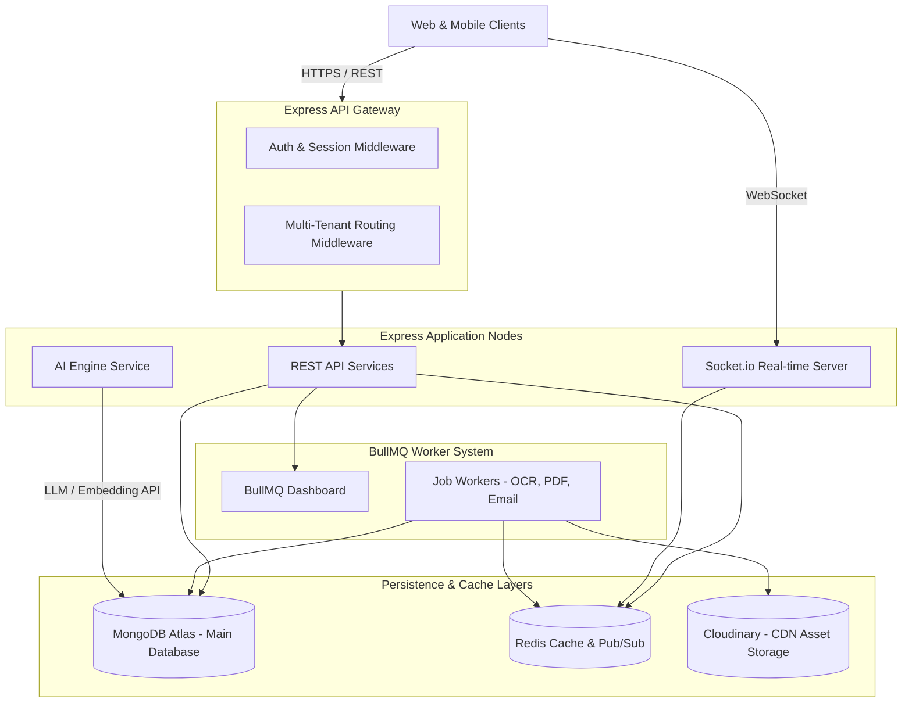
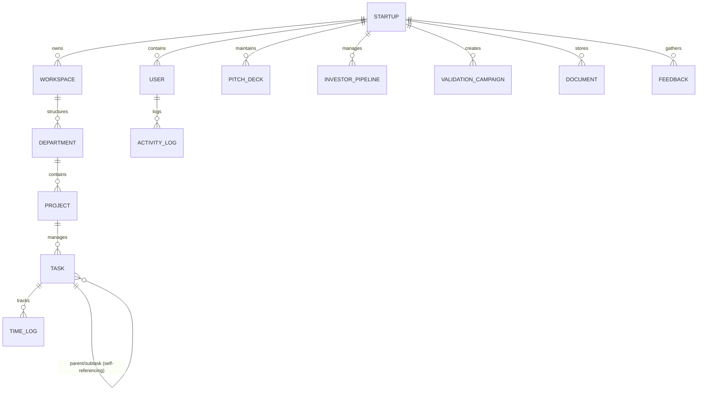
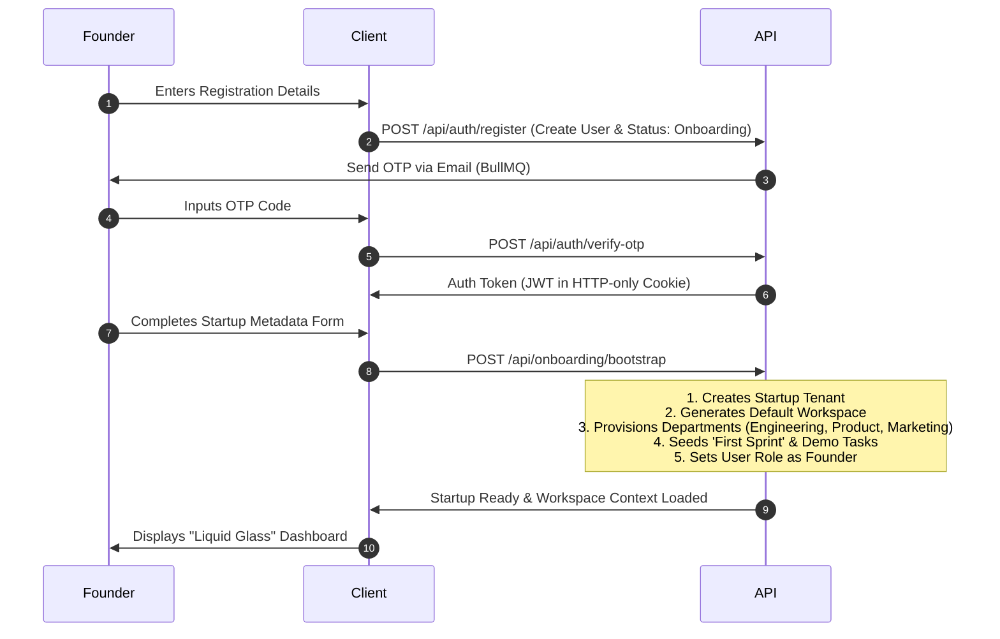
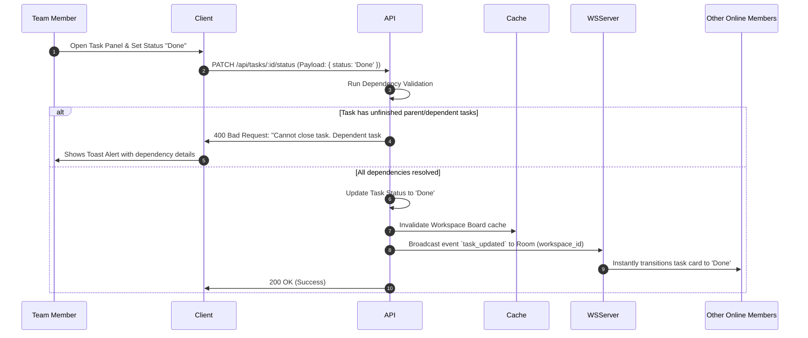
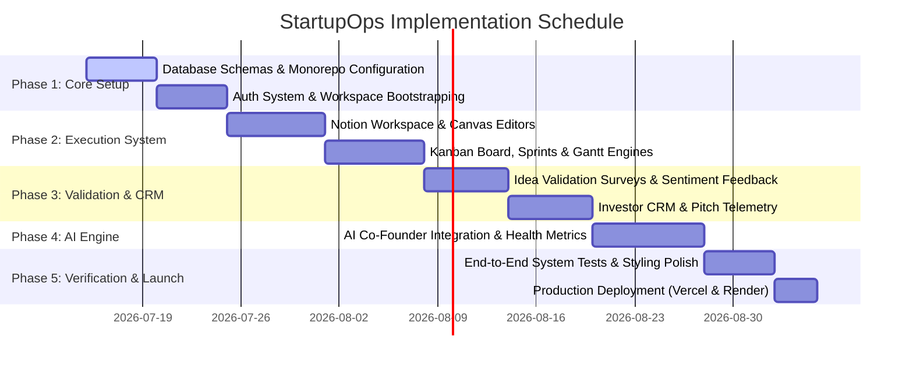

# Implementation Plan: StartupOps — Digital Operating System for Founders

StartupOps is a multi-tenant, enterprise-grade digital operating system designed for early-stage startup founders. The platform integrates features from tools like Linear, Notion, Jira, Stripe, Vercel, and PitchBook into a unified, high-performance ecosystem. 

This document outlines the system architecture, database design, backend API endpoints, frontend architecture, and a complete implementation roadmap to deliver a production-ready product.

---

## Technical Architecture Overview

StartupOps uses a hybrid monorepo structure with a backend built on **Node.js, Express, TypeScript, MongoDB, and Redis**, and a frontend built on **React 19, Vite, TailwindCSS, TypeScript, Redux Toolkit, and Framer Motion**.



---

## Multi-Tenant Database Schema

The database uses MongoDB Atlas with a multi-tenant hierarchy:
**Startup (Tenant)** $\rightarrow$ **Workspace** $\rightarrow$ **Departments** $\rightarrow$ **Projects** $\rightarrow$ **Tasks**.
Each collection containing tenant-specific data is isolated using a `startupId` or `workspaceId` index.



### Core Mongoose Schemas (TypeScript Interfaces)

#### 1. Startup (Tenant Core)
```typescript
import { Schema, Document, model } from 'mongoose';

export interface IStartup extends Document {
  name: string;
  industry: string;
  stage: 'Idea' | 'Validation' | 'Prototype' | 'Traction' | 'Scaling';
  vision: string;
  mission: string;
  logoUrl?: string;
  website?: string;
  targetMarket: string;
  revenueModel: string;
  fundingStage: 'Pre-Seed' | 'Seed' | 'SeriesA' | 'SeriesB' | 'Bootstrapped';
  expectedTeamSize: number;
  businessLocation: string;
  createdAt: Date;
  updatedAt: Date;
}

const StartupSchema = new Schema<IStartup>({
  name: { type: String, required: true, trim: true },
  industry: { type: String, required: true },
  stage: { type: String, enum: ['Idea', 'Validation', 'Prototype', 'Traction', 'Scaling'], required: true },
  vision: { type: String, required: true },
  mission: { type: String, required: true },
  logoUrl: { type: String },
  website: { type: String },
  targetMarket: { type: String, required: true },
  revenueModel: { type: String, required: true },
  fundingStage: { type: String, enum: ['Pre-Seed', 'Seed', 'SeriesA', 'SeriesB', 'Bootstrapped'], required: true },
  expectedTeamSize: { type: Number, required: true },
  businessLocation: { type: String, required: true }
}, { timestamps: true });

StartupSchema.index({ name: 'text' });
```

#### 2. User & Tenant Roles
```typescript
export interface IUser extends Document {
  email: string;
  passwordHash?: string;
  googleId?: string;
  githubId?: string;
  fullName: string;
  avatarUrl?: string;
  isVerified: boolean;
  verificationOtp?: string;
  otpExpiry?: Date;
  status: 'Active' | 'Suspended' | 'Onboarding';
  createdAt: Date;
}

export interface IMember extends Document {
  startupId: Schema.Types.ObjectId;
  userId: Schema.Types.ObjectId;
  role: 'Founder' | 'Co-Founder' | 'Admin' | 'Team Member' | 'Mentor' | 'Investor' | 'Guest';
  departmentId?: Schema.Types.ObjectId;
  permissions: string[];
  joinedAt: Date;
}
```

#### 3. Tasks & Time Tracking
```typescript
export interface ITask extends Document {
  workspaceId: Schema.Types.ObjectId;
  projectId: Schema.Types.ObjectId;
  title: string;
  description?: string;
  status: 'Backlog' | 'Todo' | 'In Progress' | 'In Review' | 'Done';
  priority: 'Low' | 'Medium' | 'High' | 'Urgent';
  assignees: Schema.Types.ObjectId[];
  reporter: Schema.Types.ObjectId;
  startDate?: Date;
  dueDate?: Date;
  estimatedHours?: number;
  actualHours?: number;
  parentTaskId?: Schema.Types.ObjectId;
  labels: string[];
  dependencies: Schema.Types.ObjectId[]; // Tasks that must complete first
  checklist: { item: string; isCompleted: boolean }[];
  attachments: { name: string; url: string; uploadedBy: Schema.Types.ObjectId }[];
}

const TaskSchema = new Schema<ITask>({
  workspaceId: { type: Schema.Types.ObjectId, ref: 'Workspace', required: true, index: true },
  projectId: { type: Schema.Types.ObjectId, ref: 'Project', required: true, index: true },
  title: { type: String, required: true },
  description: { type: String },
  status: { type: String, enum: ['Backlog', 'Todo', 'In Progress', 'In Review', 'Done'], default: 'Todo' },
  priority: { type: String, enum: ['Low', 'Medium', 'High', 'Urgent'], default: 'Medium' },
  assignees: [{ type: Schema.Types.ObjectId, ref: 'User' }],
  reporter: { type: Schema.Types.ObjectId, ref: 'User', required: true },
  startDate: { type: Date },
  dueDate: { type: Date },
  estimatedHours: { type: Number },
  actualHours: { type: Number, default: 0 },
  parentTaskId: { type: Schema.Types.ObjectId, ref: 'Task' },
  labels: [{ type: String }],
  dependencies: [{ type: Schema.Types.ObjectId, ref: 'Task' }],
  checklist: [{ item: String, isCompleted: { type: Boolean, default: false } }],
  attachments: [{ name: String, url: String, uploadedBy: { type: Schema.Types.ObjectId, ref: 'User' } }]
});
```

---

## Complete Module Blueprint

### Module 1: Startup Profile & Strategic Canvas
- **Feature Set**: Company profiles, multi-founder boards, visual **Business Model Canvas Editor**, interactive **SWOT Matrix**, Competitor Intelligence matrices, and live Elevator Pitch evaluators.
- **Premium Element**: A unified dashboard showing value proposition alignment metrics and market sizing validation (TAM/SAM/SOM calculators).

### Module 2: Document Workspace (Notion-Like)
- **Feature Set**: Real-time collaborative documents using Block-Editor representations, nesting markdown hierarchy, embedded PDF/media previews, document-level comments, version history, and bookmarks.
- **Premium Element**: Live rich-text editing synchronized over WebSockets with presence cursors, inline slash (`/`) commands to link projects, tasks, or investors.

### Module 3: Project & Sprint Management
- **Feature Set**: High-fidelity Kanban board with drag-and-drop mechanics, Sprint Board planning, interactive interactive Sprints, Timeline / Gantt chart engine (client-side rendering via Recharts & D3 components), recurring tasks, subtasks, task dependencies, and automated Burndown metrics.
- **Premium Element**: Linear-style keyboard shortcuts (e.g., `Cmd + K` Command Palette), automated velocity forecasting based on historical completion speeds.

### Module 4: Milestones & Strategic Goal Roadmaps
- **Feature Set**: Interactive roadmap visualizers, milestone dependencies mapping, blocked status indicator, risk indicator models (AI-driven alerts if milestone dependencies are delayed), progress trackers.
- **Premium Element**: Milestone chains where progress dynamically recalculates based on actual project tasks mapped to the milestone.

### Module 5: Team CRM & Performance Dashboards
- **Feature Set**: Invitation workflows with custom permission parameters, departments mapping (Engineering, Marketing, Sales, etc.), attendance tracking, task ownership, workload analytics (burnout risks), performance leaderboards.
- **Premium Element**: "Workload Heatmap" showing task overload metrics for each engineer or marketer, predicting delays.

### Module 6: Idea Validation & Survey Engine
- **Feature Set**: Visual customer interview loggers, customized survey creators, voting portals, Idea Validation scoring system (using algorithm weightings for Problem intensity, Market Size, Willingness to Pay, and Execution Complexity), AI text summaries.
- **Premium Element**: Dynamic feedback forms that founders can publish externally with subdomains (`startupops.co/v/my-startup`).

### Module 7: 360 Feedback System
- **Feature Set**: Feedback compilation from external, internal, mentor, and investor channels. Public feedback portals with integrated Sentiment Analysis (NLP engine parsed on text submissions), recommendation engines.
- **Premium Element**: Sentiment indicator charts showing how mentor or investor sentiment changes week-over-week.

### Module 8: AI Co-Founder & Coach
- **Feature Set**: Conversational LLM interface acting as a co-founder. Suggests tasks, milestones, analyzes business model canvases, generates OKRs, weekly goals, business/GTM strategies, and investor Q&A decks.
- **Premium Element**: The AI runs automated workspace sweeps nightly, suggesting tasks for the next day based on blockers, and offering custom critiques.

### Module 9: Executive Analytics & Startup Health Metrics
- **Feature Set**: Real-time calculated Startup Health Score, Burn Rate indicators, Runway projections, Growth charts, Sprint Velocity analytics.
- **Premium Element**: Dynamic "What-If" Runway Scenario Simulator allowing founders to toggle new hires or funding injections and visualize monthly runways.

### Module 10: Pitch Deck Builder & Investor CRM
- **Feature Set**: Slide generator (financial summaries, traction, market opportunities, roadmaps), PDF exporter, secure Investor Share Link (with active analytics measuring view duration, scroll depth, and slides visited).
- **Premium Element**: Slide viewer with integrated access tracking, showing founders which slides investors spent the most time reading.

### Module 11: Document Storage & OCR Center
- **Feature Set**: File repository for incorporation, NDAs, cap tables, and financial statements. Automated OCR processing (mock extraction of PDF contents to make them fully indexed and searchable).
- **Premium Element**: Global search that matches content inside uploaded PDFs, not just the title.

### Module 12: Investor Relations CRM
- **Feature Set**: Interactive Pipeline Kanban (Prospect, Contacted, Pitching, Due Diligence, Closed), meeting minutes log, email open trackers, custom follow-up alarms.
- **Premium Element**: Rich CRM templates and integrations showing email sync status.

### Module 13: Real-Time Event & Notification Hub
- **Feature Set**: Real-time notification updates (Socket.io), custom browser pushes, email alerts, reminders for tasks, milestones, and investor meetings.
- **Premium Element**: Actionable notification cards in-app (users can complete tasks directly from the notification popover).

### Module 14: Automated AI Insight Engine
- **Feature Set**: Automated warnings e.g., "Developer workload exceeding, customer validation weak," or "Competitor pricing model missing."
- **Premium Element**: A slide-out panel containing actionable "Remedies" that can create tasks or update models automatically.

### Module 15: Startup Health Score & Risk Meter
- **Feature Set**: An algorithm calculating scores out of 100 based on Validation, Execution, Traction, Funding, Team, and Product metrics. Includes a risk meter (visual dial) with automated advisory reports.
- **Premium Element**: Liquid glass visualization with a glowing radial score dial.

### Module 16: Communication & Collaboration
- **Feature Set**: Workspace chat channels, direct messages, announcement boards, automated video meeting link creation.
- **Premium Element**: Rich-text messaging with inline code blocks, thread replies, and file embeds.

### Module 17: Interactive Master Calendar
- **Feature Set**: Calendar aggregation engine displaying tasks, milestones, investor follow-ups, and sprints in one unified layout. Integrated Google Calendar synchronization structure.
- **Premium Element**: Drag-and-drop reschedule updates where shifting a meeting on the calendar automatically moves task deadlines and triggers notification updates.

### Module 18: File Management System
- **Feature Set**: Unified file viewer, version control, folder hierarchy, live Cloudinary media previews.
- **Premium Element**: Multi-version document history where founders can rollback files to previous states.

### Module 19: Command Palette & Global Search
- **Feature Set**: Quick action search indexing projects, tasks, documents, team members, comments, and files.
- **Premium Element**: Keyboard command shortcut (`Cmd + K`) containing contextual quick-actions (e.g. "Create task", "Go to Pitch Deck", "Ask AI Co-Founder").

### Module 20: Settings & Customization
- **Feature Set**: Workspace branding controls, active sessions list, billing status, Google/GitHub integrations, notifications toggles, theme switcher.
- **Premium Element**: Detailed audit logs capturing every deletion, update, and export done inside the tenant.

---

## Functional Requirements

1. **Isolation**: A user in Startup A must never see data belonging to Startup B. Every database query must scope through `req.user.startupId`.
2. **Speed & Caching**: Sprints and Kanban boards must load in under 100ms. Redis must cache read operations for tasks and sprints, invalidated on writes.
3. **Task Dependency Locking**: If Task B depends on Task A, Task B cannot be marked "Done" until Task A is resolved.
4. **Real-time Synchronization**: When a team member edits a task status on a Kanban board, the change must reflect instantly on the screen of other online members.
5. **AI Integration**: AI generations must stream responses to the client (Server-Sent Events) to minimize perceived latency.

---

## User Stories

*   **As a Founder**, I want to create a Business Model Canvas and SWOT Matrix, and have the system evaluate my market size (TAM/SAM/SOM), so that I can validate my business plan.
*   **As a Co-Founder**, I want to assign projects and set milestones with strict dependencies, so that the team can execute without coordination bottlenecks.
*   **As a Team Member**, I want to update my sprint tasks, log time spent, and view my weekly workload, so that I can hit my deliverables and avoid burnout.
*   **As an Investor**, I want to open a secure link to the startup's Pitch Deck and financial sheets, viewing specific slides, while the startup founder receives telemetry analytics about my interest level.
*   **As a Mentor**, I want to leave comments, feedback, and sentiment ratings on a startup's validation surveys and GTM strategy, so that I can guide the founders.
*   **As an Admin**, I want to review tenant billing, check access logs, toggle workspace features, and handle member provisioning, so that the workspace remains secure.

---

## End-to-End Workflows

### 1. Unified Onboarding & Workspace Bootstrapping


### 2. Interactive Task Creation with Dependency Checks


---

## Detailed REST & WebSocket API Specification

### Authentication & Tenant Management
- `POST /api/auth/register` : Account registration (returns pending verification state)
- `POST /api/auth/verify-otp` : Authenticates OTP, returns cookie token
- `POST /api/auth/login` : Login user, starts session
- `POST /api/auth/google` / `POST /api/auth/github` : OAuth callback routes
- `POST /api/onboarding/bootstrap` : Creates startup record, workspaces, departments, and seed data
- `POST /api/members/invite` : Generates invite token and emails invite link to new member

### Projects & Sprints (Real-time synced)
- `GET /api/projects` : Fetch startup projects list
- `POST /api/projects` : Create project (requires Founder/Admin)
- `GET /api/projects/:projectId/tasks` : Get project Kanban board data (Cached)
- `POST /api/tasks` : Create task (emits `task_created` over Socket.io)
- `PATCH /api/tasks/:id` : Update task title, status, description, assignees, or priority
- `POST /api/tasks/:id/log-time` : Log hours spent on tasks (updates analytics database)

### AI Co-Founder Engine (Server-Sent Events)
- `POST /api/ai/chat` : Send message to AI Co-Founder (streams Markdown chunks)
- `POST /api/ai/generate-canvas` : Suggests values for Business Model Canvas fields
- `POST /api/ai/analyze-health` : Sweeps DB and outputs recommendations, OKRs, and roadmaps

### Investor CRM & Pitch Tracking
- `POST /api/investors/pipeline` : Add investor profile to CRM
- `PATCH /api/investors/pipeline/:id` : Transition investor stage (e.g., Prospect $\rightarrow$ Contacted)
- `POST /api/pitch-deck/generate` : Generates PDF slides using template engine (handled asynchronously by BullMQ)
- `GET /api/pitch-deck/view/:shareToken` : Viewer endpoint for investors. Logs scroll depth telemetry.
- `POST /api/pitch-deck/telemetry` : Endpoint called by frontend tracker. Records slide viewing duration.

### Analytics & Health System
- `GET /api/analytics/health-score` : Calculates aggregate health index, score trends, and warning points.
- `GET /api/analytics/runway` : Fetch burn rate details, run runway scenarios.

---

## Frontend Architecture

The frontend is built on a scalable, modular folder layout optimized for feature isolation and rapid deployment.

```
/client
├── public/
├── src/
│   ├── assets/              # Premium image assets, custom SVGs
│   ├── components/
│   │   ├── ui/              # Custom Glassmorphic ShadCN elements (Button, Card, Dialog, etc.)
│   │   └── layout/          # Sidebar, Navbar, Page Wrapper
│   ├── config/              # Constant declarations and config values
│   ├── features/            # Feature modules (Domain-driven approach)
│   │   ├── auth/
│   │   ├── onboarding/
│   │   ├── profile/         # BMC, SWOT, Competitors
│   │   ├── workspace/       # Notion-like Editor, Pages
│   │   ├── projects/        # Kanban, Gantt, Calendar, Tasks
│   │   ├── validation/      # Survey builder, interviews
│   │   ├── ai/              # Co-founder chat interface
│   │   ├── analytics/       # Charts, Scenarios, Health score dials
│   │   ├── documents/       # File viewer, OCR uploaders
│   │   └── investors/       # Pitch Deck visualizer, CRM Board
│   ├── hooks/               # Core utility hooks (useSocket, useAuth, etc.)
│   ├── routes/              # Protected routing structure based on roles
│   ├── store/               # Redux Toolkit setup
│   │   ├── index.ts
│   │   └── slices/          # Slices for global UI state, active workspaces
│   ├── services/            # Axios API wrappers with base headers
│   ├── index.css            # Base Tailwind customization, global variables
│   ├── main.tsx
│   └── vite-env.d.ts
├── tailwind.config.js       # Custom animations, Liquid Glass gradients, blurs
├── tsconfig.json
└── vite.config.ts
```

---

## User Panels & Liquid Glass Dashboard Designs

### Design Principles (Liquid Glass UI)
- **Backgrounds**: Slate-950 backdrop with floating, organic mesh gradients (`#6366f1` Indigo, `#a855f7` Purple, `#10b981` Emerald) executing slow infinite rotations.
- **Panels**: `backdrop-blur-md bg-white/5 border border-white/10 shadow-[0_8px_32px_0_rgba(99,102,241,0.08)]` to produce the glass reflection.
- **Typography**: Inter/Outfit with heavy weights for titles, clean text, and bright color coding for labels.
- **Interactive States**: Interactive hover gradients that pulse when cursor is on cards, active spring animations using Framer Motion.

```
+--------------------------------------------------------------------------------------+
|  [Logo] StartupOps             [Command Palette Cmd+K]              (Avatar) Founder  |
+--------------------------------------------------------------------------------------+
|  (Workspace Switcher)  |  [Dashboard] Health Score: 87/100 (Pulse Glow)              |
|  - Engineering         |  +--------------------+  +--------------------+             |
|  - Marketing           |  | Runway: 14 Months  |  | Burn Rate: $12k/mo |             |
|                        |  +--------------------+  +--------------------+             |
|  [Features]            |  +-------------------------------------------------------+  |
|  - Profile & Canvas    |  | Task Velocity (Burndown Curve Chart)                  |  |
|  - Notion Workspace    |  |                                                       |  |
|  - Sprints & Kanban    |  +-------------------------------------------------------+  |
|  - Validation Engine   |  +--------------------+  +--------------------+             |
|  - AI Co-Founder       |  | System Recommendations|  | Pitch Deck Telemetry|             |
|  - Document Center     |  | - Complete SWOC    |  | - Sequoia read slide |             |
|  - Investor CRM        |  | - Run 5 interviews |  |   3 for 4.2 mins     |             |
|  - Communication       |  +--------------------+  +--------------------+             |
+--------------------------------------------------------------------------------------+
```

### Role-Specific Interfaces

#### 1. Founder & Co-Founder Panel
- Full access to all settings, Cap Table managers, Investor CRM controls, Financial metrics, AI recommendations, and Pitch deck customization.
- **Top Priority Widget**: Runway Risk Simulator and AI Co-founder advice stream.

#### 2. Team Member Panel
- Focused on Execution. Shows custom personal dashboards with assigned tasks, calendar integrations, Sprints timelines, active task trackers, and departmental documentation.
- **Top Priority Widget**: "My Day" tracker showing priority tasks, deadlines, and a button to request help or flag blockers.

#### 3. Mentor Panel
- Access to Startup Profiles, Business Model Canvas, Pitch Deck, and Validation surveys. Mentors cannot edit tasks or financial information, but can leave sticky notes, sentiment votes, and feedback.
- **Top Priority Widget**: Feedback board with a text editor to submit advisory notes and grade validation models.

#### 4. Investor Panel
- Simplified viewer layout. When an investor clicks their custom link, they enter a dark-mode, glass-styled slide viewer displaying the pitch deck, traction charts, financial summary, cap table structure, and validation data.
- **Top Priority Widget**: A simple Q&A field allowing them to send questions straight to the Founder’s chat.

#### 5. Administrator Panel
- Multi-workspace controls, subscription/billing options, overall system logs, role configurations, performance audits, and export features.

---

## Phased Implementation Roadmap



### Sprint 1: Foundation & Bootstrapping (Days 1–10)
- Configure monorepo backend and frontend structures.
- Setup MongoDB schemas, Mongoose models, and Redis caching.
- Build authentication routes (JWT, Google OAuth) and OTP verification system.
- Build onboarding bootstrap controller which sets up workspaces, departments, and templates on registration.

### Sprint 2: Core Execution & Collaborative Workspace (Days 11–24)
- Build Notion-style editor using EditorJS or TipTap, storing document blocks in MongoDB.
- Build Kanban Board with Socket.io sync, task detail dialogs, checklists, and time tracking.
- Build Gantt chart timeline interface utilizing D3-based client SVG layers.
- Build Interactive Business Model Canvas and SWOT Matrix editors.

### Sprint 3: Validation, CRM, & Document OCR (Days 25–36)
- Build survey creator engine, external feedback portals, and Sentiment NLP parser.
- Build Investor CRM board showing interactive drag-and-drop pipelines.
- Integrate Cloudinary storage and build OCR extraction service using Tesseract.js (background process managed by BullMQ).
- Build Pitch Deck Slide Viewer with telemetry code to record slide-by-slide viewing times.

### Sprint 4: AI Engine & Executive Analytics (Days 37–44)
- Integrate OpenAI/Anthropic API for AI Co-founder streaming chat.
- Add background agent sweeps to automatically compile health score recommendations.
- Build Runway Scenario Simulator with Recharts.
- Render Startup Health score dashboard using SVG liquid dials and glows.

### Sprint 5: Refinement, Verification, & Launch (Days 45–52)
- Perform testing: Jest for API controllers, Playwright for end-to-end user flows.
- Review Tailwind variables, apply full Liquid Glass borders and shadows.
- Deploy frontend to Vercel, API backend to Render, and schedule task workers.

---

## Production Deployment & Scalability Plan

```
                              [ User Traffic ]
                                      |
                                      v
                             [ Cloudflare WAF ]
                                      |
                                      v
                             [ Vercel CDN Edge ]
                           /                   \
                          v                     v
              [ React 19 Frontend ]       [ Render Load Balancer ]
                                                 |
                                     +-----------+-----------+
                                     |                       |
                                     v                       v
                             [ Express Node 1 ]      [ Express Node 2 ]
                                     |                       |
                                     v                       v
                         [ Redis Cache / Pub-Sub ] <-> [ Redis Session Store ]
                                     |
                         +-----------+-----------+
                         |                       |
                         v                       v
                [ MongoDB Atlas Cluster ]    [ BullMQ Job Workers ]
                         |                       |
                         v                       v
                [ Vector Search Index ]     [ Tesseract OCR Parser ]
```

1. **Multi-Tenant Database Scaling**:
   - As tenant numbers grow, transition from single collection indexing to **Database-Level Sharding** in MongoDB Atlas, using `startupId` as the shard key. This ensures data for a single startup stays colocated on the same shard node, minimizing cross-shard queries.
2. **Real-time Scale**:
   - Socket.io is configured with a **Redis Adapter** so that WebSocket rooms and state broadcast correctly across multiple Express application nodes running behind Render's load balancer.
3. **Optimized Asset Delivery**:
   - Files, NDAs, and pitch decks are stored on Cloudinary and cached on a Global CDN. Private documents are delivered using Cloudinary signed URLs to ensure only authenticated tenant members can access files.
4. **Resilient Background Processing**:
   - Heavy tasks (PDF compiles, OCR scanning, daily health reviews, emails) are offloaded to **BullMQ workers** run in independent, resource-optimized containers to ensure API endpoints remain fast and responsive.

---

## Open Questions & Review Areas

> [!IMPORTANT]
> **Authentication Framework**: Do we want to support native authentication (JWT via HTTP-only Cookies + Express Session) or integrate a third-party manager like Clerk?
> *Design Recommendation*: We recommend native JWT authentication to allow complete database-level control of tenant switching.

> [!WARNING]
> **AI Co-Founder API Costs**: High volume streaming chats and nightly workspace sweeps will generate substantial LLM usage costs. We need to implement API rate limiting per workspace (e.g., maximum 50 prompts per day per team member).

> [!NOTE]
> **OCR Engine Choice**: Cloud-based Tesseract.js is great for basic text detection. For enterprise-grade document processing (structured contracts, cap sheets), we might want to integrate AWS Textract later.
